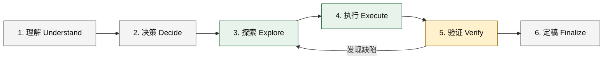

# agent-orchestration-workflow

一套面向“指挥者 + 外部执行工作者”的可移植 AI 协作策略。它把高价值判断留给指挥者，把大规模阅读、实现、改写、测试和迭代交给执行工作者，并通过证据、风险分级和最终复核控制质量。

> 本仓库是独立的社区项目，不是任何厂商的官方产品。它不提供 `codex-worker` 的实际实现，也不承诺可测量的成本节省、速度提升或质量增益。策略效果取决于任务、模型、提示、工具权限和复核质量。

[English](README.en.md) | [完整策略](AGENTS.md) | [工作流](docs/workflow.md) | [工作者契约](docs/worker-contract.md) | [安全指南](docs/security.md)

## 核心思路

这套策略区分两个角色：

- **指挥者（commander）**负责理解目标、关键决策、架构与论证、风险判断、关键复核和最终接受。
- **执行工作者（worker）**负责高吞吐执行，例如广泛检索、跨文件实现、批量改写、测试、失败诊断和重复验证。

它不是“凡事都委派”。判断标准是语义性的：**让指挥者亲自消耗上下文完成这一执行步骤，是否会比交给可靠的工作者产生显著更高的价值？** 如果会，就直接处理；如果不会，并且任务包含大量执行或上下文消耗，就考虑委派。短问题、少量文件阅读、显而易见的小修复和交互式教学通常不值得承担委派开销。

## 六阶段生命周期



1. **理解**：指挥者澄清目标、约束、受众、成功标准和外部影响。
2. **决策**：指挥者决定技术策略、任务边界、风险等级，以及哪些工作适合委派。
3. **探索**：工作者优先完成大范围阅读、搜索和证据提取，形成压缩后的信息包。
4. **执行**：工作者在明确范围内实现、改写、整理或分析，并保留无关内容。
5. **验证**：工作者做广泛检查；指挥者按风险做关键复核。失败时回到探索或执行。
6. **定稿**：只有指挥者能作最终判断、接受本地成果，并在另有授权时执行外部发布。

详见[工作流说明](docs/workflow.md)。

## 六种领域模式

| 模式 | 指挥者重点 | 工作者重点 |
| --- | --- | --- |
| SOFTWARE | 需求、架构、API、数据、安全、最终接受 | 仓库探索、实现、调试、重构、测试、迁移 |
| PAPER | 论文主张、贡献定位、证据含义、最终修辞 | 代码与实验核对、数字检查、术语与语言一致性 |
| RESEARCH | 研究问题、冲突证据评价、综合结论 | 广泛取证、来源比较、事实/推断/不确定性分离 |
| DOCUMENT | 受众、目的、结构、信息层级、最终质量 | 材料阅读、提取、起草、表格、批量改写与一致性 |
| LEARNING | 解释、直觉、诊断误解、互动反馈 | 批量计算、练习生成、答案检查、案例收集 |
| DECISION | 权衡、个体影响、不确定性、最终建议 | 规格、比较数据、背景事实和证据收集 |

`GENERAL` 可用于不属于上述领域的普通执行任务，但应同样明确范围、风险和验收标准。

## 渐进式披露

面对大型仓库、长论文或广泛研究材料，不要让指挥者先吞下全部原始上下文。先让工作者生成高密度信息包，指挥者阅读压缩结果后，只对高风险结论、争议证据或必要原文做定向核查：

```text
大规模材料 -> 工作者阅读与压缩 -> 信息包 -> 指挥者判断 -> 定向原文复核
```

仓库提供[仓库情报包](templates/repository-intelligence-pack.md)、[论文审查包](templates/paper-review-pack.md)和[研究包](templates/research-pack.md)。压缩不是证据替代品；重要结论必须可追溯到具体文件、章节、命令结果或来源。

## 自主执行与按风险复核

一次委派应尽量覆盖完整、受限的执行循环：

```text
检查 -> 执行 -> 验证 -> 诊断失败 -> 修正 -> 重新验证 -> 自检 -> 报告
```

工作者应在验收标准满足后返回，而不是每做一步就请求指挥者介入。若外部依赖阻塞，应报告已完成工作和缺失证据，不应无限重试或自行扩大范围。

复核强度与风险相称：身份认证、授权、安全、持久化、核心算法、论文主张和重要业务结论属于高风险，应深入检查；跨模块行为通常至少做关键路径和代表性检查；机械映射、格式化和低风险规范化可更多依赖自动检查与抽样。任何级别都不能盲信工作者报告。

“已完成”必须有证据：列明改动文件、实际运行的检查、关键输出、未运行的检查、残余风险和未决判断。不要把计划运行、推测通过或工作者自述写成已经验证的事实。

## 前提与运行方式

本仓库仅包含策略、文档、模板和示例。你需要自行提供一个名为 `codex-worker` 的可执行程序，并放在 `PATH` 中。它必须：

1. 将工作区路径作为第一个位置参数；
2. 从标准输入读取完整提示；
3. 将工作报告写到标准输出，并以非零退出码表示执行失败。

先检查前提：

```sh
command -v codex-worker >/dev/null 2>&1 || {
  echo "codex-worker is required but was not found on PATH" >&2
  exit 1
}
```

然后在**经过审查的专用工作区**中使用可复制命令：

```sh
cat <<'WORKER_PROMPT' | codex-worker "$PWD"
MODE:
SOFTWARE

OBJECTIVE:
完成一个边界清晰、可验证的本地任务。

CONTEXT:
仅包含完成任务所需的上下文；不要包含凭据或无关私密材料。

TASK:
检查相关文件，实施范围内变更，并运行适当验证。

REQUIREMENTS:
- 保留无关内容和行为。
- 不扩大权限或任务范围。
- 不执行外部发布。

ACCEPTANCE CRITERIA:
- 指定行为已实现。
- 相关检查实际通过，或明确报告未能运行及原因。

AUTONOMY:
执行合理的 inspect -> execute -> verify -> fix -> reverify 循环后再返回。

OUTPUT:
按 worker-report 模板返回紧凑、可追溯的报告。
WORKER_PROMPT
```

完整字段见[委派模板](templates/delegation.md)，报告格式见[工作者报告模板](templates/worker-report.md)。

如果没有兼容的可执行程序，安全的手动后备方式是：在专用工作区中复制[委派模板](templates/delegation.md)，人工删去敏感和无关内容，将经过审查的提示提交给你选择的执行系统；收到结果后，以相同风险标准人工检查文件和证据。不要用临时脚本假装兼容适配器，也不要把任意目录自动交给未知工具。

## 安全边界

这些说明是协作政策，**不是沙箱、权限系统或数据隔离机制**。外部工作者会通过第三方提供方处理你提交的提示和可访问材料。使用前必须理解其数据保留、训练、日志、地域和工具权限政策，并审查所有出站内容。

不要让工作者检查 API 密钥、修改凭据、修改认证、修改 Codex 配置、修改私有工作者配置目录、递归启动另一个工作者或继续委派。敏感决策保留给指挥者。建议使用干净的专用工作区和最小权限，并在执行前确认路径与材料范围。

不要在未知项目上自动信任或运行策略。若项目已有 `AGENTS.md`，先阅读、比较并人工合并适用条款；不要覆盖项目策略，也不要把本仓库策略强行安装为用户的全局指令。

本地修改获准并不自动授权外部行为。推送、发起拉取请求、发布软件包、发送消息或公开仓库，应在用户授权范围内执行。已有授权持续有效，不应在执行前重复询问；正常本地编辑、检查和提交按任务范围推进。详见[安全指南](docs/security.md)。

## 失败处理

工作者失败时，先做简短诊断：提示是否含糊、输入是否过大、权限或依赖是否缺失、验证是否不稳定。适合时可重试一次或缩小范围；大规模修正仍可交给工作者，小问题可由指挥者直接处理。当委派开销超过收益时，切换为手动执行。失败不是扩大权限、忽略验收标准或虚构验证结果的理由。

## 采用方式

1. 在干净的测试工作区阅读[完整策略](AGENTS.md)和[安全指南](docs/security.md)。
2. 将策略与你现有的项目指令逐条比较，解决冲突后再合并；不要覆盖现有 `AGENTS.md`。
3. 从[委派模板](templates/delegation.md)开始，为任务写清目标、范围、禁止事项和证据型验收标准。
4. 先用低风险、可回滚、无敏感数据的任务试运行。
5. 根据报告做风险分级复核，记录实际检查和残余不确定性。

示例均为说明性材料，不是实际基准结果：[软件任务](examples/software-task.md)和[论文任务](examples/paper-task.md)。

## 贡献与许可

贡献前请阅读[CONTRIBUTING.md](CONTRIBUTING.md)。本项目以 [MIT License](LICENSE) 发布。
