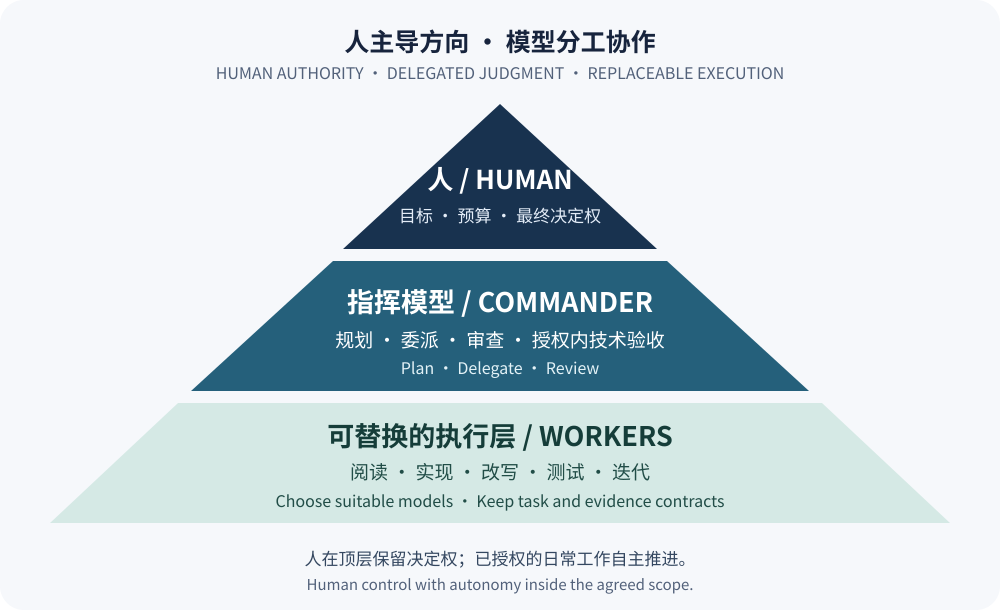
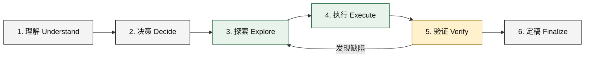

# agent-orchestration-workflow

**人定方向，强模型做判断，可替换的 Worker 承担大量执行。**

一套以高性价比为目标的 AI 协作工作流：把昂贵的推理与上下文留给架构、判断和关键复核，让适合任务的经济型执行模型完成阅读、实现、改写、测试与迭代。通过清晰分工与可追溯证据，争取用相同预算交付更多合格成果。

[English](README.en.md) | [完整策略](AGENTS.md) | [工作流](docs/workflow.md) | [性价比与成本核算](docs/economics.md) | [Worker 接口与替换](docs/worker-contract.md) | [安全指南](docs/security.md)

## 人在顶层的协作金字塔



| 层级 | 核心责任 | 决定权边界 |
| --- | --- | --- |
| **人：目标与最终决定权** | 确定目标、价值取舍、预算和授权；接受、否决或调整成果 | 可随时修改方向、停止任务或更换模型 |
| **指挥模型：判断与组织** | 理解需求、拆解任务、设计方案、委派执行、审查证据 | 在人的授权范围内作技术决策与验收 |
| **Worker：执行与交付** | 广泛阅读、实现、批量改写、测试、修正和报告 | 在明确范围内自主执行，不接管目标与高层决策 |

人掌握最高决定权，同时允许模型在已授权范围内完成闭环。日常实施无需逐步审批；改变目标、超出授权或突破约定预算时，再交由人决定。指挥模型的技术验收服务于人的最终判断。

## 高性价比来自怎样的分工

**把每一份模型预算花在它最有价值的任务上。** 强模型负责难以替代的判断，Worker 承担大量可验证执行。高性价比主要来自四个环节：

- **转移大量执行消耗**：仓库搜索、长材料阅读、编码和反复测试交给能力达标、成本合适的 Worker。
- **压缩回传上下文**：Worker 提交证据包，指挥模型先读结论与定位，再定向检查原文。
- **一次委派完成闭环**：执行、诊断、修正和复测在任务边界内连续完成，减少来回调度。
- **按风险复核**：高风险判断深入检查，低风险机械工作结合自动检查与抽样，减少重复阅读。

| 工作方式 | 主要成本落点 | 更适合的情况 |
| --- | --- | --- |
| 主模型直接处理 | 理解、执行、迭代都消耗主模型资源 | 小任务、交互教学、难以拆分的判断任务 |
| 指挥模型 + Worker | 主模型负责规划与复核，Worker 承担大部分执行 | 执行量大、边界清楚、结果可验证的任务 |

衡量收益时，要区分**主模型额度、实际费用和全流程 token 总量**。主模型用量下降，并不代表总 token 同比例下降；额外委派、返工和复核也要计入。目标是降低每项合格成果的总成本。本仓库尚未发布对照测量，因此不承诺固定节省比例。详见[成本核算与示例](docs/economics.md)。

## Worker 模型可替换，工作方法可复用

Worker 是角色，`codex-worker` 是本文使用的调用入口，底层模型和供应商可以替换。可以按任务选择更擅长代码、文档、长材料处理的模型，也可以接入具备所需工具能力的本地模型；指挥模型本身同样不绑定某个品牌。

```text
人确定目标与授权
        ↓
指挥模型 → 统一任务与验收契约 → Worker 适配器 → 所选模型与执行工具
        ↑                          ↓
        └──── 交付物、证据、报告 ────┘
```

替换时保留任务边界、输入输出约定和质量标准，再用相同任务验证工具调用、文件改动、报告真实性、耗时和总成本。更换模型需要适配与验证；本仓库提供策略和契约，未附带通用模型适配器。具体步骤见[Worker 契约](docs/worker-contract.md)。

## 与 Astra + DeepSeek 实践的关系

社区作者 Artforartsake99 在 [Astra + 8 Deepseek 4.1 subagents. Insanely cheap tokens.](https://www.reddit.com/r/vibecoding/comments/1wg5ogw/astra_8_deepseek_41_subagents_insanely_cheap/) 中分享了 Astra 编排、DeepSeek 执行的做法。本文借鉴其直观的角色分工表达，将它组织为可迁移的工作方法：**人主导目标，指挥模型管理质量，执行模型按需替换。**

该帖是社区经验，不是本项目的性能证明；我们未据此推算节省率，也不要求使用 Astra、DeepSeek 或固定数量的 Worker。参考信息与证据边界见[成本说明](docs/economics.md)。

本仓库是独立社区项目，采用 MIT 许可证，不是任何厂商的官方产品。

## 何时委派

判断标准是语义性的：**指挥模型亲自完成这一步，是否会比可靠的 Worker 产生显著更高的价值？** 短问题、小修复和交互式教学通常直接处理；大量执行与上下文处理优先委派。角色可以有多个实例，但并发数量由任务独立性、预算和整合成本决定，增加 Worker 数量本身不保证更省钱。

## 六阶段生命周期



1. **理解**：指挥者澄清目标、约束、受众、成功标准和外部影响。
2. **决策**：指挥者决定技术策略、任务边界、风险等级，以及哪些工作适合委派。
3. **探索**：工作者优先完成大范围阅读、搜索和证据提取，形成压缩后的信息包。
4. **执行**：工作者在明确范围内实现、改写、整理或分析，并保留无关内容。
5. **验证**：工作者做广泛检查；指挥者按风险做关键复核。失败时回到探索或执行。
6. **定稿**：指挥者在人的授权内完成技术验收与交付，按已有授权执行发布；人保留最终接受、否决和调整的决定权。

详见[工作流说明](docs/workflow.md)。

## 六种领域模式

| 模式 | 指挥者重点 | 工作者重点 |
| --- | --- | --- |
| SOFTWARE | 需求、架构、API、数据、安全、最终接受 | 仓库探索、实现、调试、重构、测试、迁移 |
| PAPER | 论文主张、贡献定位、证据含义、最终修辞 | 代码与实验核对、数字检查、术语与语言一致性 |
| RESEARCH | 研究问题、冲突证据评价、综合结论 | 广泛取证、来源比较、事实/推断/不确定性分离 |
| DOCUMENT | 受众、目的、结构、信息层级、最终质量 | 材料阅读、提取、起草、表格、批量改写与一致性 |
| LEARNING | 解释、直觉、诊断误解、互动反馈 | 批量计算、练习生成、答案检查、案例收集 |
| DECISION | 权衡、个体影响、不确定性、最终建议 | 规格、比较数据、背景事实和证据收集 |

`GENERAL` 可用于不属于上述领域的普通执行任务，但应同样明确范围、风险和验收标准。

## 渐进式披露

面对大型仓库、长论文或广泛研究材料，不要让指挥者先吞下全部原始上下文。先让工作者生成高密度信息包，指挥者阅读压缩结果后，只对高风险结论、争议证据或必要原文做定向核查：

```text
大规模材料 -> 工作者阅读与压缩 -> 信息包 -> 指挥者判断 -> 定向原文复核
```

仓库提供[仓库情报包](templates/repository-intelligence-pack.md)、[论文审查包](templates/paper-review-pack.md)和[研究包](templates/research-pack.md)。压缩不是证据替代品；重要结论必须可追溯到具体文件、章节、命令结果或来源。

## 自主执行与按风险复核

一次委派应尽量覆盖完整、受限的执行循环：

```text
检查 -> 执行 -> 验证 -> 诊断失败 -> 修正 -> 重新验证 -> 自检 -> 报告
```

工作者应在验收标准满足后返回，而不是每做一步就请求指挥者介入。若外部依赖阻塞，应报告已完成工作和缺失证据，不应无限重试或自行扩大范围。

复核强度与风险相称：身份认证、授权、安全、持久化、核心算法、论文主张和重要业务结论属于高风险，应深入检查；跨模块行为通常至少做关键路径和代表性检查；机械映射、格式化和低风险规范化可更多依赖自动检查与抽样。任何级别都不能盲信工作者报告。

“已完成”必须有证据：列明改动文件、实际运行的检查、关键输出、未运行的检查、残余风险和未决判断。不要把计划运行、推测通过或工作者自述写成已经验证的事实。

## 前提与运行方式

本仓库仅包含策略、文档、模板和示例。你需要自行提供一个名为 `codex-worker` 的可执行程序，并放在 `PATH` 中。它必须：

1. 将工作区路径作为第一个位置参数；
2. 从标准输入读取完整提示；
3. 将工作报告写到标准输出，并以非零退出码表示执行失败。

先检查前提：

```sh
command -v codex-worker >/dev/null 2>&1 || {
  echo "codex-worker is required but was not found on PATH" >&2
  exit 1
}
```

然后在**经过审查的专用工作区**中使用可复制命令：

```sh
cat <<'WORKER_PROMPT' | codex-worker "$PWD"
MODE:
SOFTWARE

OBJECTIVE:
完成一个边界清晰、可验证的本地任务。

CONTEXT:
仅包含完成任务所需的上下文；不要包含凭据或无关私密材料。

TASK:
检查相关文件，实施范围内变更，并运行适当验证。

REQUIREMENTS:
- 保留无关内容和行为。
- 不扩大权限或任务范围。
- 不执行外部发布。

ACCEPTANCE CRITERIA:
- 指定行为已实现。
- 相关检查实际通过，或明确报告未能运行及原因。

AUTONOMY:
执行合理的 inspect -> execute -> verify -> fix -> reverify 循环后再返回。

OUTPUT:
按 worker-report 模板返回紧凑、可追溯的报告。
WORKER_PROMPT
```

完整字段见[委派模板](templates/delegation.md)，报告格式见[工作者报告模板](templates/worker-report.md)。

如果没有兼容的可执行程序，安全的手动后备方式是：在专用工作区中复制[委派模板](templates/delegation.md)，人工删去敏感和无关内容，将经过审查的提示提交给你选择的执行系统；收到结果后，以相同风险标准人工检查文件和证据。不要用临时脚本假装兼容适配器，也不要把任意目录自动交给未知工具。

## 安全边界

这些说明是协作政策，**不是沙箱、权限系统或数据隔离机制**。使用第三方后端的工作者会将提交的提示和可访问材料交由该提供方处理；本地后端的网络和工具权限也需要核实。使用前必须理解其数据保留、训练、日志、地域和工具权限政策，并审查所有出站内容。

不要让工作者检查 API 密钥、修改凭据、修改认证、修改 Codex 配置、修改私有工作者配置目录、递归启动另一个工作者或继续委派。敏感决策保留给指挥者。建议使用干净的专用工作区和最小权限，并在执行前确认路径与材料范围。

不要在未知项目上自动信任或运行策略。若项目已有 `AGENTS.md`，先阅读、比较并人工合并适用条款；不要覆盖项目策略，也不要把本仓库策略强行安装为用户的全局指令。

本地修改获准并不自动授权外部行为。推送、发起拉取请求、发布软件包、发送消息或公开仓库，应在用户授权范围内执行。已有授权持续有效，不应在执行前重复询问；正常本地编辑、检查和提交按任务范围推进。详见[安全指南](docs/security.md)。

## 失败处理

工作者失败时，先做简短诊断：提示是否含糊、输入是否过大、权限或依赖是否缺失、验证是否不稳定。适合时可重试一次或缩小范围；大规模修正仍可交给工作者，小问题可由指挥者直接处理。当委派开销超过收益时，切换为手动执行。失败不是扩大权限、忽略验收标准或虚构验证结果的理由。

## 采用方式

1. 在干净的测试工作区阅读[完整策略](AGENTS.md)和[安全指南](docs/security.md)。
2. 将策略与你现有的项目指令逐条比较，解决冲突后再合并；不要覆盖现有 `AGENTS.md`。
3. 从[委派模板](templates/delegation.md)开始，为任务写清目标、范围、禁止事项和证据型验收标准。
4. 先用低风险、可回滚、无敏感数据的任务试运行。
5. 根据报告做风险分级复核，记录实际检查和残余不确定性。

示例均为说明性材料，不是实际基准结果：[软件任务](examples/software-task.md)和[论文任务](examples/paper-task.md)。

## 贡献与许可

贡献前请阅读[CONTRIBUTING.md](CONTRIBUTING.md)。本项目以 [MIT License](LICENSE) 发布。
