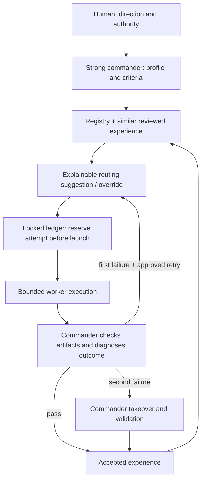

# Adaptive Worker Routing — Implementation and acceptance report

Historical implementation snapshot at commit 959de12. The portable revision supersedes its initial model pool and adapter list; see [host adapters](../host-adapters.md).

Date: 2026-09-24. Baseline: `02d975a`. Status: implemented and locally validated; operational model-cost advantage is **not yet measured**. This report covers code and controlled-entry behavior, not an OS security boundary.

## A. CURRENT_ARCHITECTURE

The baseline was Human → Commander → external `codex-worker`. AGENTS defined understanding, dispatch, review, one rework, direct takeover and project experience. Templates recorded task/review/handoff information. `validate_review.py` provided post-hoc static acceptance checking. The private launcher selected its configured model and saved execution output; it had no task-aware registry, runtime lineage counter, retrieval or learning router.

The complete pre-modification 16-area audit is [CURRENT_ARCHITECTURE_ASSESSMENT.md](CURRENT_ARCHITECTURE_ASSESSMENT.md). Prompt duties were POLICY_ENFORCED; old checker duties STATIC_CHECKED. There was no pre-launch two-round enforcement.

## B. IMPLEMENTED_ARCHITECTURE

A single POSIX-locked JSON ledger commits task transitions and experience together using atomic replace and fsync. No daemon or background model requests. The commander still decides whether any worker is justified. `profile/create/route/run/review/takeover/recover/inspect/validate` provide an explicit lifecycle.

## C. DATA MODELS

[DATA_MODELS.md](DATA_MODELS.md) defines TaskSignature, WorkerDefinition, RoutingDecision, ExperienceRecord, OutcomeDiagnosis, Task, Attempt, Review, Takeover and Ledger. `routing/defaults.json` centralizes candidate resources, attempts, timeout, matching weights, confidence thresholds, windows, penalties and exploration. `templates/adaptive-task.example.json` is an intentionally unfilled real-task template.

## D. ROUTING ALGORITHM

1. Validate the structured semantic profile; exclude unavailable/disabled or capability-incompatible workers.
2. Retrieve comparable reviewed outcomes separately for each model/provider/effort identity.
3. Form a transparent initial prior from configurable task/domain/reasoning tendencies.
4. Compute similarity × recency × version weights. Each logical task contributes at most one unit to ability evidence, even with two attempts.
5. Shrink empirical accepted quality toward prior with four effective samples of prior weight. Accepted quality can be reduced by actual final quality and repair severity; failure penalties use attribution, type and severity.
6. Compare observed cost, latency and repair burden when comparable. Unknown is null. Configured cost/latency priors are explicitly distinguished from observed measurements.
7. Apply manual override, attempt-aware retry, or eligible opportunistic exploration; otherwise choose highest score with deterministic tie-breaking.
8. Record all candidate summaries, explanation, excluded counts, used experience IDs and confidence in the actual reserved attempt.

Score is an inspectable heuristic, not a calibrated probability or universal model ranking. Raw sample count never adds a performance bonus. More valid evidence changes confidence and prior shrinkage, which is intentional uncertainty handling.

## E. EXPERIENCE RETRIEVAL

Structured matching requires the same domain and same/explicitly related task type. Opposite low/high reasoning contexts are excluded. Subtype, language, framework, scope, complexity, tool/reasoning intensity, cross-module scope, volume, risk and verification contribute configured weights. Weaker historical verification cannot establish stronger current confidence; low-risk outcomes do not establish high-risk fit, and non-production history does not establish production fit.

This conservative design avoids transferring React styling success directly to distributed transactions. Commander-provided profile and repository context remain important: automatic semantic extraction or embeddings are not implemented.

## F. EXPERIENCE UPDATE

Each execution produces a pending record. Review atomically records tests, evidence, diagnosis, outcome and disposition. First failure records retry intention; second reservation fills the actual next worker and SAME_WORKER/DIFFERENT_WORKER. Second success records second-pass acceptance. Second failure marks takeover required. Commander takeover adds repair burden and final task status without granting worker success credit.

Probes/synthetic tests never become normal learning samples. No historical Markdown is imported as verified model-performance evidence. Project-local lessons supplement structured routing outcomes.

## G. FAILURE ATTRIBUTION

Only MODEL_RELATED rejected outcomes affect ability scoring. Spec, environment, tool, data, service and UNKNOWN failures remain auditable but are excluded from ability and associated economic penalties. Invalid/cancelled/user-changed/corrupted outcomes are also excluded. Minor formatting/local mistakes and reasoning/architecture failures have different weights. The commander must justify classification from artifacts; the program cannot prove causal attribution.

The core implementation worker in this change reached its execution bound after writing code/tests and experiencing connection failures. The commander took over integration. This is recorded as uncertain/service-affected completion, not a fabricated model-quality failure.

## H. ATTEMPT ROUTING

The same intact ledger reserves rounds under lock before launch. Initial call is attempt 1, approved correction is attempt 2 regardless of model. A local error tends to retain the worker; serious reasoning/architecture/loop/context failures tend to select an eligible alternative. The commander can explicitly override either choice. Attempt 2 requires a complete commander handoff with immutable identity/criteria and “THIS IS WORKER ATTEMPT 2 OF 2.”

Second rejection cannot authorize another worker. Commander takeover is the remaining path. Canonical task IDs, declared parent/fix aliases and every registered work-key fingerprint share the original count. Changing provider/model, restarting Workflow or renaming a declared alias cannot reset it. Undeclared semantic equivalence is explicitly an enforcement gap.

## I. EXPERIENCE WEIGHTING

Default half-life 90 days, maximum age 365 days; future/expired evidence is excluded. Model-version mismatch defaults to 0.5 weight; zero discount safely excludes the record. LOW/MEDIUM/HIGH use effective independent task weight with thresholds 4/12, so old/version-discounted samples reduce confidence. Two perfect observations remain low confidence; a 20/24 record can outweigh a 2/2 result. Cost/latency/repair averages also use recency/similarity/version weights. Descriptive acceptance rates are observed rates, not guaranteed future probabilities.

## J. EXPLORATION POLICY

Deterministic exploration is enabled by configuration only when risk=low, verification=strong, environment is not production, there is valid comparable history, the alternative is within the score gap and has fewer independent samples. Never exploratory retry; never high-risk exploration. No fixed random percentage. Manual human selection remains available within eligibility and unchanged attempt budget.

## K. WORKER REGISTRY

Initial candidates: `gpt6_sol_xhigh` and `gpt56_sol_high`. Neither is permanently primary. Provider is `configured_gateway`, avoiding claims about the gateway's underlying deployment. Version is unspecified when no snapshot is available.

Adding a worker requires a registry record and tool-capable adapter, then controlled probes and low-risk real experience. `codex_worker` passes model/effort flags to the local launcher; generic `command` adapters consume JSON stdin and an argv list without shell expansion. New providers do not require rewriting the router. The public repository does not contain credentials/private launcher code.

## L. MODIFIED FILES

| Files | Purpose |
| --- | --- |
| `routing/__init__.py`, `models.py`, `defaults.json` | Contracts, profiling, registry/config validation and priors |
| `routing/selection.py` | Retrieval, conditional ROI summaries, scoring, exploration and retry routing |
| `routing/store.py` | Locked atomic ledger and attempt/identity invariants |
| `routing/service.py` | Creation, aliases, pre-launch reservation, execution, review, attribution, recovery and takeover |
| `routing/validation.py` | Static routing/experience/acceptance consistency and current evidence hashes |
| `scripts/route_worker.py` | Explicit commander CLI |
| `scripts/validate_review.py` | Optional `--routing-ledger`; legacy checker remains supported |
| `tests/test_selection.py`, `tests/test_routing_workflow.py` | Routing scenarios, runtime transitions and regressions |
| `templates/adaptive-task.example.json` | Starter contract with placeholders |
| `docs/adaptive-routing/*` | Baseline assessment, design, contracts, operation and this report |
| `AGENTS.md`, READMEs, CHANGELOG, structured-handoff/global-adoption/worker-contract docs | Adopt new entry point and correct earlier policy-only claims |
| `records/2026-09-24-adaptive-routing.md` | Commander acceptance, evidence and experience |

Local-only: launcher backed up and extended with per-call model/effort flags; global policy and installed workflow snapshot updated with backup. Private settings, provider endpoint and credentials are not published.

## M. TEST RESULTS

The full suite contains **46 passing tests** at final local validation, including the existing 16 legacy checker regressions. Tests use temporary synthetic fixtures, never train the live experience store.

| Scenario | Verification | Result |
| --- | --- | --- |
| A Cold start | prior → controlled execution → review → stored experience | PASS |
| B Historical exploitation | comparable evidence overturns prior | PASS |
| C Local error | A → A attempt 2, second success recorded | PASS |
| D Model mismatch | A → B, identity/count and handoff preserved | PASS |
| E Both fail | second failure → commander takeover, third refused | PASS |
| F Environment failure | excluded from model suitability; retry can retain worker | PASS |
| G Small sample | shrinkage and independent task count; 2/2 not certain | PASS |
| H Recency | expiry/future/version discount; zero weight safe | PASS |
| I Exploration | low risk/strong verification/close gap/undersampled candidate | PASS |
| J High risk | no exploration; weak/low-risk history excluded | PASS |
| K Manual override | specified eligible model; no extra attempts | PASS |
| L Budget bypass | known rename/fix/parent/new process preserves budget | PASS within declared identity; hidden semantic identity GAP |
| M New worker | third registered model routes without special code | PASS |

Additional regressions cover concurrent reservations, corrupted state, worker-role guard, evidence mutation, missing checks, takeover verification, real subprocess argv/stdin, timeout and descendant process cleanup, malformed config, currencies and repair quality penalties.

Two real isolated adapter probes succeeded: requested GPT-6 Sol/xhigh (~21.15 s) and GPT-5.6 Sol/high (~13.13 s), both exit 0 with independently checked exact artifact content. These verify current adapter connectivity and requested parameters, not provider model authenticity, general quality, or relative economic superiority. Both are source_kind=probe and excluded from suitability learning; actual billing was unavailable.

Architecture review identified and resolved: declared alias-key budget hole; orphan descendant on timeout; stale/contradictory acceptance evidence; zero-version-weight division; low-assurance historical confidence inflation. Commander validated fixes with targeted regressions. Review was independent for those findings; final repairs were verified by the commander, not represented as another independent review.

## N. ENFORCEMENT MATRIX

| Rule | Classification | Boundary |
| --- | --- | --- |
| ≤2 executions, reserve before launch | HARD_ENFORCED | supported entry, intact single ledger |
| switch/manual override retains attempts | HARD_ENFORCED | canonical/declared lineage |
| concurrent reservation and atomic update | HARD_ENFORCED | POSIX lock and local filesystem |
| report requires review before retry/accept | HARD_ENFORCED | API state transitions; review truth not provable |
| attempt 2 failure requires takeover | HARD_ENFORCED | third `run` rejected |
| criteria/check disposition/hash required at acceptance | HARD_ENFORCED + STATIC_CHECKED | evidence existence/integrity, not semantic correctness |
| registry/signature/diagnosis/experience consistency | STATIC_CHECKED + entry validation | unknown provenance cannot be inferred |
| failed worker not credited for commander takeover | HARD_ENFORCED | supported update path |
| worker role cannot call CLI | HARD_ENFORCED only while marker retained | marker removal remains possible |
| scope obedience/no recursive direct launcher | POLICY_ENFORCED | no OS permission isolation |
| Human authority/strong reviewer capability/true attribution | POLICY_ENFORCED | human and commander responsibility |
| known aliases cannot reset budget | HARD_ENFORCED | alias/work-key/parent mappings |
| undisclosed same task, alternate/deleted ledger, direct launch | NOT_CURRENTLY_ENFORCEABLE | semantic and same-user bypass |
| immutable provenance/authenticated model version/reviewer | NOT_CURRENTLY_ENFORCEABLE | no signed service audit or identity proof |
| universal cost superiority | NOT_CURRENTLY_ENFORCEABLE | requires comparable real outcomes and billing |

## O. REMAINING RISKS

Selection bias persists because workers are not randomly assigned comparable tasks. Attribution can be wrong even when schema-valid. Small samples remain uncertain; conservative context filtering may slow learning. Manual ledger edits or mislabelled probes can contaminate evidence. Unspecified model snapshots limit drift detection. Fine task tags can over-specialize; broad tags can over-generalize. Router/JSON rewrite overhead grows with history and is not yet measured at large scale. Cost priors are estimates and repair minutes are approximate. Same-user access can bypass scope/role/ledger controls; generic adapter registration is trusted code execution. POSIX local tests do not establish Windows, distributed storage or adversarial security guarantees.

## P. NEXT ITERATION

Collect representative real project outcomes before adjusting priors or confidence thresholds. Add provider-specific usage receipts, consistent repair-time measurement, and reviewed invalidation/supersession workflows. Audit conditional error rates and accepted output per total cost over comparable task cohorts. Introduce calibration, compacted history/indexing or authenticated runtime separation only when data and scale justify them. Do not train a model or introduce a vector database merely to replace an explainable first version.
