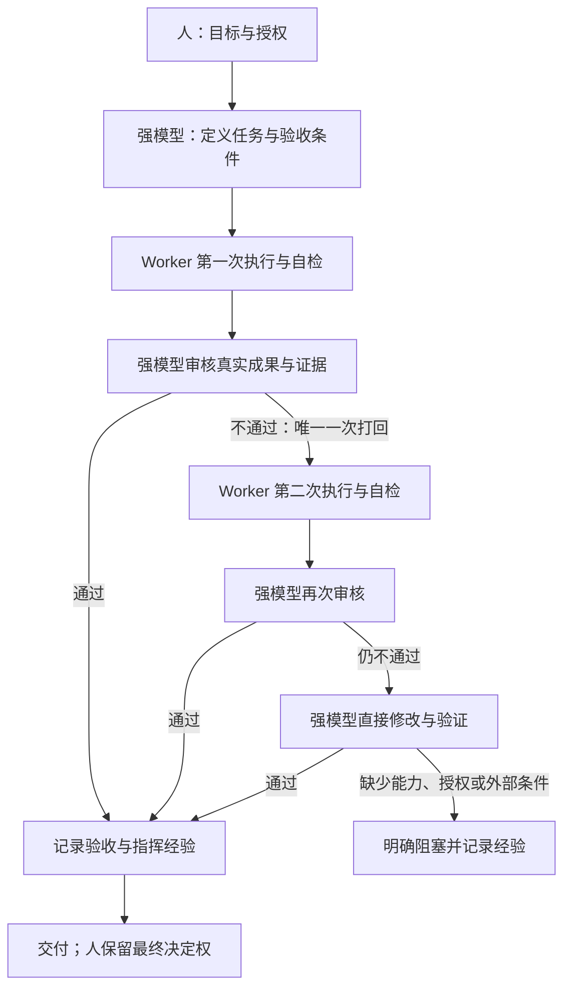

# 强模型指挥、两轮执行与强制验收

人决定目标、预算、授权与最终取舍。强模型指挥者负责拆解、分派、风险判断、关键证据复核和技术验收。主会话使用 Sol、Astra 或其他模型都承担这个角色；不按型号取消委派，也不假定某个名字天然能胜任所有审核。能力不足时记录缺口并升级处理，不能声称已经自动切换到更强模型。

## 一条任务的闭环



允许指挥者提前接管。第二次 Worker 提交不合格后，禁止第三次 Worker 执行。指挥者接管后的成果也必须满足原验收标准；不能以“已用尽次数”作为通过理由。

## 次数怎么算

- 同一逻辑任务最多两轮：初次执行一次，指挥者打回后重做最多一次。不是每个模型各两次。
- 启动调用前写任务 ID、基线、当前轮次、范围、验收条件与停止条件。启动失败或是否执行不确定时保守计入；等待同一个运行实例不另计次数。
- 一轮内部允许有界的检查、修改和复测。它们必须围绕同一交付物，不能通过无限内部循环绕过预算、时限或外部阻塞。
- 换会话、换模型、换 Worker、改任务名、改目标版本都不清零。真正独立的新需求记录新范围与旧任务关系；禁止把未解决缺陷包装成新任务。
- 第二轮后仍失败，指挥者直接修改；不把修复转交另一个便宜或昂贵 Worker。无法完成就记为 blocked，并说明缺失条件。

## 审核不能省掉什么

每次提交都记录指挥者、成果版本、实际检查、证据、缺陷及决策。决策为 accept / rework / takeover / blocked。只有第一轮可以 rework。高风险结论核对原始证据；低风险工作可抽查，但必须有明确验收判断。

Worker 自检、退出码 0、另一模型说 APPROVE，都不等于已验收。必需检查未执行、证据过期或缺陷未解决时不能 accept。指挥者亲自修改后复核受影响标准；单人复核要如实说明，不能冒称独立第二模型评审。

验收既检查各项成果，也检查整合后的目标是否完成。技术验收在人的既有授权内进行，不需要逐步重复请示；人仍可否决或改变目标。

## 每次工作都留下可用经验

每个委派任务必须留下项目内经验记录，包括失败、接管和阻塞任务。可复用现有 issue、任务日志或 [经验模板](../templates/experience-record.md)，不强制增加文件。简单直接处理的工作可将验收和经验合为一行，相关小修改可批量记录。

记录：当时如何指挥、依据、结果、根因（未知就写未知）、下一次如何改进分派、适用范围、失效条件、复核人和状态。没有新发现时明确记“无新增经验”及检查依据，不制造普遍规律。只把有证据支持的范围标为 verified；其他推测保持 candidate。

后续分派前检索相关且已核验的经验；证据变化时修订或废弃。经验不能覆盖人的授权，也不自动写入用户级记忆或私有配置。发布到公开仓库前必须脱敏，私有证据不因“必须积累”而自动公开。

## 可执行的静态验收检查

本仓库提供 Python 3.9+ 标准库脚本：

```sh
python3 scripts/validate_review.py records/review.json --root .
python3 -m unittest discover -s tests -v
```

记录结构见 [review-record.example.json](review-record.example.json)。示例是未执行任务，校验失败是预期行为。验收记录与任务契约互补：任务契约用于派发，验收记录汇总实际执行轮次、复核和证据。

脚本拒绝第三轮、非法打回、缺少验收或经验、缺少接管修复记录，以及成果/证据文件 SHA-256 不匹配。返回 0 仅表示静态记录一致。它不调用模型、不验证签名或证据语义，不证明审核者的能力，不能阻止绕过脚本直接调用 Worker，也无法发现被隐瞒的执行历史。必须由真实指挥者完成审核；接入其他 runner 时在派发前持久化计数，在完成前运行检查，不把脚本当完整调度器。

## 参考与取舍（2026-09-23 查阅）

| 一手来源 | 采用的思想 | 本工作流的限制 |
| --- | --- | --- |
| [LangGraph supervisor](https://github.com/langchain-ai/langgraph-supervisor-py) | 中央主管通过工具分派、控制上下文 | 仓库已归档，README 推荐直接工具调用；只借鉴模式，不引入归档依赖 |
| [Anthropic evaluator–optimizer 示例](https://github.com/anthropics/anthropic-cookbook/blob/main/patterns/agents/evaluator_optimizer.ipynb) | 评价反馈与执行分开，反馈具体到缺陷 | 本项目额外固定两轮上限、指挥者接管和经验记录；这些是用户要求，不是示例证明的最优参数 |
| [AutoGen 终止条件](https://microsoft.github.io/autogen/stable/user-guide/agentchat-user-guide/tutorial/termination.html) / [源码仓库](https://github.com/microsoft/autogen) | 明确终止条件与状态 | 消息计数不是任务执行次数，且示例运行后会重置；我们的逻辑任务计数跨调用保留 |

本轮项目经验见 [经验记录](../records/2026-09-23-experience.md)。

这些设计提高可追溯性、限制无效返工；尚未完成同任务、同验收质量的成本对照，不宣称固定节约比例或总体优越性。
