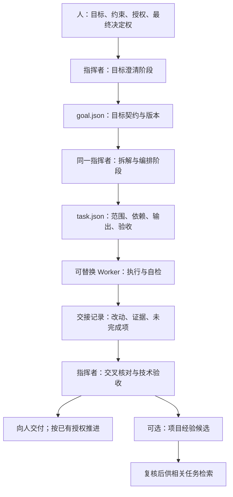

# 结构化交接：从分工原则到可核对的任务

现有流程已经明确人、指挥者和 Worker 的分工，也有证据包、风险分级复核与报告模板。本次优化增加可选的目标契约、任务契约、交接记录和经验记录，适用于跨会话、多步骤或多人协作任务。这类任务默认保留精简记录，JSON 模板是可选格式；已有 issue、计划或任务文档能覆盖同样字段时直接复用，不重复建档。短问题与小修复继续直接处理。

本轮交付是文档与示例，未提供调度器、JSON Schema 校验器、执行沙箱、知识图谱或自动记忆系统。JSON 能被解析，不代表目标可行、授权有效或结果已经验收。

## 对照分析

以下对照基于用户提供的流程截图，按用户说明将左侧视为本项目、右侧视为另一套工作流。截图展示了设计名称，没有展示源码、运行记录或性能对照，因此下表评估的是可借鉴的机制。

| 截图中的设计 | 对本项目的价值 | 采纳方式 |
| --- | --- | --- |
| 人与 analyst 形成 goal.json | 提前固定目标、非目标和验收条件，减少执行后的理解偏差 | 采纳目标契约；analyst 先作为指挥者的目标澄清阶段 |
| bridge 读契约、拆解、组建 Worker、验收 | 让任务分解和成果整合有明确责任 | 采纳编排阶段；由现有指挥者承担，不强制增加模型层 |
| task-*.json 记录动作、输出、文件、检查、依赖与经验 | 更容易逐项核对、定位遗漏和交接恢复 | 提供可选 JSON 模板；先人工审查字段，再决定是否开发校验工具 |
| 子代理隔离上下文 | 控制每个执行者接收的信息，减少重复背景和无关指令 | 使用最小任务包；外部 Worker 保留可替换接口，不绑定某种 Agent 工具 |
| L1–L4、索引与图谱 | 有望支持跨任务复用与检索 | 先做项目级经验记录与简单索引；截图未说明四层含义，不推定其定义 |
| cross_check、agent_runner、graph.py、handoff | 有望把分派、核验、恢复变成可执行工具 | 先落成交接与交叉核对步骤；工具名本身不能证明实现或验收能力 |

“本仓库知识沉淀无”需要限定：当前公开仓库已有证据包与报告模板，但此前没有持久经验的状态、适用范围和失效规则。这不等于使用者的整个工作环境没有记忆。公开仓库没有交付运行工具，也不等于本地外部 Worker 不存在。

## 优化后的结构

角色拆分首先意味着职责清楚，并不要求每个框对应一个独立模型。只有在上下文负担、专业能力或并行独立性有实际收益时，才拆成独立调用。所有 Worker 仍由指挥者分配任务，不递归委派。

上下文隔离只控制模型接收的信息，不等于文件系统、凭据或网络隔离。工具创建的子代理与外部 Worker 都要分别核对实际权限；不能从“隔离上下文”推断安全沙箱已经存在。

## 1. 先约定要完成什么

使用 [goal-contract.json](../templates/goal-contract.json) 记录目标、非目标、验收条件、约束、预算和已有授权依据。人给出意图，指挥者整理为契约；已有明确授权不必再签一次。关键歧义才需要交回人决定。

`revision` 表示目标版本。验收标准或范围改变时递增版本，重新检查受影响任务；不要静默用新标准验收旧任务。预算未指定时记录未知，不能解释成无限预算，也不应因此阻塞普通低成本操作。

## 2. 再决定谁做哪一块

使用 [task-contract.json](../templates/task-contract.json) 指向目标 ID 和版本。将验收条件映射到必要检查，列出预期输出和可改文件。只注入与任务有关、来源明确的经验，不附加整个历史会话。

`deps` 引用前置任务 ID。分派前确认依赖存在、没有循环，并且前置结果已被技术验收。存在共同写入文件的任务原则上串行；必要并行时明确文件所有权和整合责任。`files_to_touch` 是声明，不是文件系统权限控制。

示例：[目标](../examples/contracts/goal.json)与[任务](../examples/contracts/task-01.json)是虚构的文档修订任务，尚未执行，不能作为真实授权或通过证据。该小例子只演示字段关系；实际单个错字修订通常直接处理，无需创建这些契约。

## 3. 交接必须能核对

使用 [handoff.md](../templates/handoff.md)，逐项记录“验收条件 → 交付物 → 实际检查 → 证据 → 未决项”。区分 Worker 报告完成、指挥者已核验，以及人保留的最终决定权。

交叉核对优先检查成果与目标是否一致、实际改动是否超范围、证据是否对应当前版本，以及关键检查是否真的运行。高风险结论直接检查原始证据；低风险内容按既有政策抽查。再调用一个模型不能替代原始证据。

恢复任务时先读取目标、任务和交接记录，再核对当前文件状态与基线；只恢复仍未完成的部分。若基线改变，先判断哪些证据失效，不盲目重跑全部工作，也不沿用已过时的通过结论。

目标初始状态为 `draft`，任务初始状态为 `pending`。检查契约与依赖后，任务建议状态路径是 `pending → ready → running → reported → verified`；阻塞标为 `blocked`，被新版本替代标为 `superseded`。这是手动使用约定，本仓库没有实现状态机。执行者不能把自己报告的 `reported` 自动升为 `verified`。

## 4. 经验应当可复用，也应当可失效

使用 [experience-record.md](../templates/experience-record.md)，保存问题、适用条件、证据、采取的决定和失效条件。默认是 `candidate`，经指定复核者确认后才是 `verified`，过时后标为 `deprecated`。

只在项目明确采用此机制时写项目经验目录；本模板不授权写入用户的全局记忆、个人偏好或私有配置。检索命中的内容只是参考，不能覆盖当前任务与人的授权。开始时用标题、标签和文件索引即可；出现反复需要跨记录关系检索的需求后，再评估知识图谱。

四层知识划分暂不采纳固定定义：需要原方案的层级说明、晋升条件、冲突处理与过期策略才能评价。未经验证的经验积累越多，也可能越容易重复错误。

## 采纳顺序与验收

| 阶段 | 本轮状态 | 验收依据 |
| --- | --- | --- |
| 目标/任务契约与交接模板 | 文档与示例已提供 | JSON 可解析；示例目标 ID、版本、验收条件引用一致；链接有效 |
| 项目经验记录 | 可选模板已提供 | 包含来源、状态、适用与失效条件；没有写入全局记忆 |
| 真实任务试用 | 待验证 | 用可比任务比较漏项、返工、总费用、总耗时及人的纠偏次数 |
| 校验器、runner、持久化状态 | 未实现 | 先以真实试用定位高频机械错误，再决定实现范围 |
| 知识分层与图谱 | 暂缓 | 需要具体检索问题、样本和收益依据 |

可使用[成本与质量复核模板](../templates/cost-review.md)做前后对照。不要用模板更多、Agent 更多或 token 更少单独证明优化有效；核心是同等验收质量下，交接更可靠，人的纠偏与总成本是否下降。

## 研究参考

Anthropic 的 [Building effective agents](https://www.anthropic.com/engineering/building-effective-agents)讨论了中央编排者分解任务、委派 Worker 和整合结果的模式，并建议从满足需求的简单设计开始。因此，本项目先分清职责，再决定是否增加模型调用。

其 [Effective context engineering for AI agents](https://www.anthropic.com/engineering/effective-context-engineering-for-ai-agents)讨论了上下文外的结构化笔记，以及子代理保留详细探索上下文、向主代理回传精炼结果的做法。这支持我们试用最小任务包和可追溯交接记录，但不能证明特定四层知识系统或本项目已经获得性能收益。

以上是设计参考；本项目的采纳决策来自当前需求和约束。查阅日期：2026-09-20。
