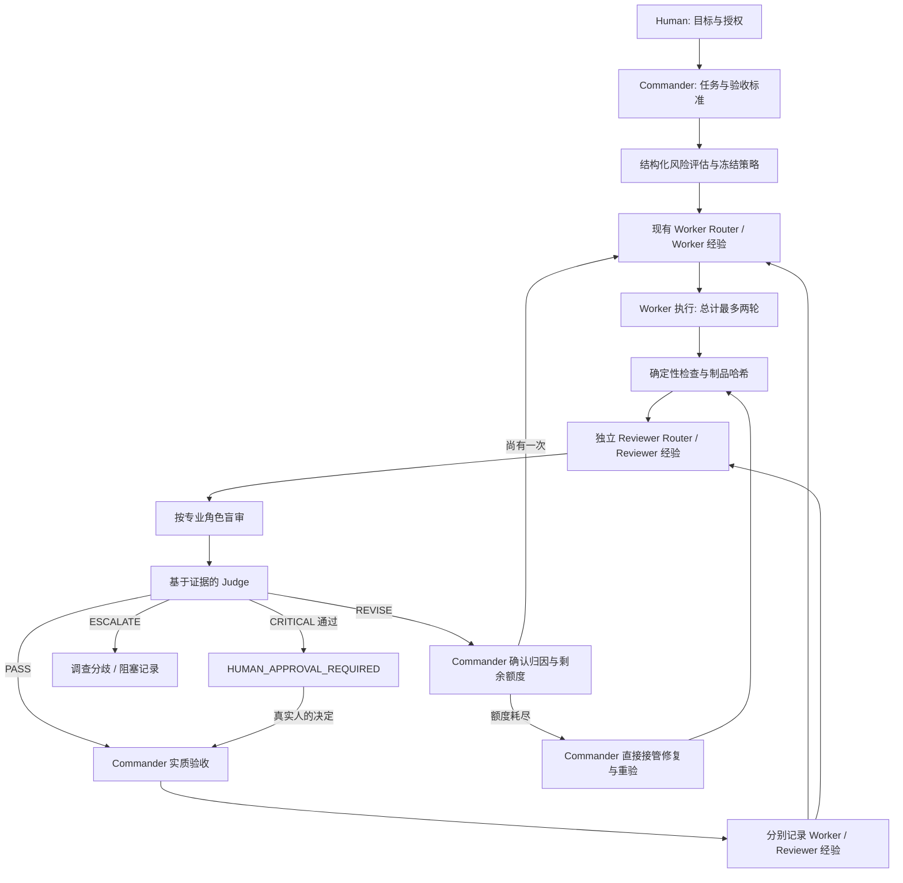

# Verification & Deliberation MVP — 实现与验收报告

日期：2026-09-26。基线：`0c249b2` 加已有本地 Jev 工作；保留原修改。本报告记录通用实现；私有模型配置、全局部署与公开发布由独立回执核对，不代表用户最终产品验收。

## 1. 原架构

[修改前完整评估](CURRENT_ARCHITECTURE_ASSESSMENT.md)。`models.py` 验证 task signature 与 registry；`selection.py` 按任务和已审历史选择 Worker；`service.py` 管理任务、稳定 identity、预留轮次、执行、Commander review、retry/takeover；`store.py` 原子持久化任务、事件与经验；`validation.py` 静态检查账本。`adapters.py` 接宿主工具。Jev 是默认关闭的独立咨询阶段。

原有两轮 Worker 上限、证据哈希、原验收标准、失败归因、经验检索保持不变。新增的是验证层，不另造 Worker Router 或数据库。

## 2. 新架构

LOW 的 RR/B 是空操作：执行检查后 Judge 建议 PASS，仍保留原 Commander 验收责任。Judge 不发起新 Worker，不替人批准。

## 3. 新增模块

- `verification_rules.py`：风险计算、策略验证、Reviewer 检索与选择、证据优先的 Judge。
- `verification_policy.json`：风险权重、阈值、安全下限、分层角色数量、预算、时间衰减、Judge 审查门槛。
- `reviewer_runtime.py`：九种角色、盲审 packet、严格输出 schema、OpenRouter 和 command bridge、超时与输出限制、实际 usage。
- `verification_service.py`：verification session、资源预留、文件快照、验收闸门、人工状态、审核反馈及静态一致性检查。

## 4. 修改的既有文件

| 文件 | 本轮修改 |
|---|---|
| `routing/service.py` | 创建时冻结可选策略；执行前预算；review 和 takeover 都验证新门槛；修订路由及经验衔接 |
| `routing/models.py` | 验证可选 verification 配置 |
| `routing/store.py` | 增加独立 reviewer_experiences，保留 schema 1 的旧账本兼容 |
| `routing/validation.py` | 静态重算风险、检查 session/资源/审核结论和经验来源 |
| `scripts/route_worker.py` | verify、verification-approve、verification-feedback、verification-recover 命令 |
| `routing/jev.py` | 阻止 reviewer 角色调用 Commander 咨询接口；此文件本身是此前未提交的 Jev 工作 |
| `AGENTS.md` | 增加验证层操作责任与边界 |
| `README.md`、`README.en.md` | 增加验证层入口、开启方式和兼容说明 |

## 5. 新增文件

| 文件 | 用途 |
|---|---|
| `routing/verification_rules.py` | 纯规则 |
| `routing/verification_policy.json` | 默认策略 |
| `routing/reviewer_runtime.py` | Reviewer 调用 |
| `routing/verification_service.py` | 状态集成 |
| `tests/test_verification_rules.py` | 风险、路由、Judge 规则测试 |
| `tests/test_reviewer_runtime.py` | 盲审、结构化输出、供应商和命令边界 |
| `tests/test_verification_workflow.py` | A–F 与完整生命周期回归 |
| `examples/registry.verification.json` | 全部禁用的可移植注册表样例 |
| `templates/verification-task.example.json` | task 扩展样例 |
| `docs/verification/CURRENT_ARCHITECTURE_ASSESSMENT.md` | 修改前审计 |
| `docs/verification/README.md` | 使用和适配指南 |
| 本报告 | 架构、验收、经验与局限 |
| `experiments/verification-20260926/` | 有界真实 Reviewer 接口探针及费用证据 |

其他未跟踪的 Jev、research、experiments 文件不属于本轮新增验证模块，未批量发布。

## 6. 数据结构变化

Task 可增加 `verification` 输入：risk_features、artifacts、checks、context、worker_reservation。创建后存为 `verification_layer`：冻结 policy/risk、资源 reservations、审核 sessions。

Session 绑定 logical_task_id、attempt_number、worker/takeover、制品清单及哈希；保存确定性 checks、Reviewer selection、reviews、Judge、human_approval、开始/结束状态。文件变更或失败 session 不可复用为已验收证据。

ReviewerDefinition 包含 provider、family、model_id、roles_supported、capabilities、cost/latency class、adapter 和资源上限。具体模型版本只存在注册表。ReviewerResult 包含 verdict、confidence、issues（每条 severity/evidence）、evidence、recommended_action、reviewer_specialty。

原 Worker Experience 扩展 `deliberation`；独立 ReviewerExperience 保存模型/快照、角色、Worker 模型、任务特征、风险、检查、结论、人工决定、最终结果、confirmed/correct 与反馈证据。真实 correctness 不等于与 Judge 一致。

## 7. Verification Policy

八个风险字段为 0–1；默认等权均值，MEDIUM/HIGH/CRITICAL 阈值 0.25/0.5/0.75。security ≥0.75 至少 HIGH；irreversibility ≥0.9 为 CRITICAL；external_side_effects ≥0.9 至少 HIGH。输入和理由可审计，未来可改权重。输入仍依赖 Commander 的诚实判断。

LOW 0、MEDIUM 1、HIGH 2 个普通 Reviewer；CRITICAL 2 个普通加 1 次对抗审核和人工状态。HIGH 可配置对抗审核。每个任务至少一个必需确定性检查，不允许只把全部检查标为 optional。缺少可用 Reviewer 时明确升级，不降级审核深度。

默认最多一次 revision，受原两轮 Worker 硬上限约束。费用/token 在每次调用前预留，后续按预留与已知实际值的较大者计入预算。中断与换模型不退回额度。Provider 真实扣费不是本地可硬性阻止的；超额或未换算币种必须升级处理。

## 8. Reviewer Router

任务语义选择不同专业角色：代码默认 correctness/code；安全优先 security；研究优先 evidence/requirements；商业优先 business/requirements；前端/体验优先 ux/code；架构优先 architecture/correctness。

候选评分是透明可配加权：条件可靠性 45%、与 Worker 独立性 25%、本组多样性 15%、成本和延迟各 7.5%。同模型独立上下文独立性 0.3，同家族 0.6，跨家族 1；这些是启动先验，不是已证实的质量差异。可靠性按任务上下文检索，更多样本只提高可信度，不是全局模型排名。

普通角色使用不同 reviewer_id；仍可能是同家族，记录其相关性，不夸大为绝对独立。对抗角色是独立调用，不看别的审核结果。没有 Reviewer 隐式循环。

## 9. Judge

先处理必需检查失败，再处理严重问题、缺失证据、置信度、可靠性与意见冲突。必需检查失败不能被 Reviewer PASS 推翻；测试全绿也不自动反驳 Reviewer 的具体反例。严重异议或 PASS/FAIL 冲突升级，不多数投票。

普通置信度门槛默认 0.5；HIGH/CRITICAL 或 Worker 历史失败率 ≥0.4 提高为 0.7。若已有至少 4 个有效衰减样本、条件 Reviewer 可靠性低于 0.4，则升级而非直接信任 PASS。冷启动无历史不会因无样本被当成已不可靠。实际专业角色必须匹配所派角色。

输出为 PASS、REVISE、ESCALATE 或 HUMAN_APPROVAL_REQUIRED，并保存理由。REVISE 的动作仍须 Commander 确认。minor_fix/strategy_failure 保留 Worker；worker_mismatch 需要 Commander 的严重模型归因后才沿既有 Router 切换；ambiguous_task 必须补充解释并进入 handoff；high_risk_uncertainty 升级。

## 10. 经验更新

每轮 Commander review/takeover 都保存 Worker 结果及关联 verification；Reviewer 的结论与最终结果存入分离的经验集合。未经 Commander 证据确认的记录只用于追踪，不参与可靠性学习。

筛选 real、valid、confirmed、同领域/任务类型/角色/模型记录；排除探针、合成任务、取消/无效及同模型执行的自评信号。高风险不直接挪用低风险经验。90 天半衰期，4 个中性先验样本平滑；有模型 revision 时要求匹配。

审核日志包含选择理由、模型、independence_score、风险、checks、意见、Judge、重做、最终结果与资源。费用/token 未提供时保持 unknown/null。它支持分析，不宣称有限样本已经证明路由变聪明。

## 11. 六种测试与实测结果

| 场景 | 实际断言 | 结果 |
|---|---|---|
| A 简单修改 | LOW，仅运行断言，Reviewer 调用 0，Commander 后接受 | PASS |
| B 中等任务 | MEDIUM，选择 Claude fixture 审 GPT Worker，记录独立经验及确认反馈 | PASS |
| C 隐藏 bug | 模拟 Reviewer 发现 a-b；同 Worker 第 2 轮修复为 a+b；禁止第 3 轮 | PASS |
| D Reviewer 错判 | Reviewer PASS 遇到确定性 failed 必须 REVISE | PASS |
| E 意见冲突 | 两个不同角色 PASS/FAIL → ESCALATE，不能接受 | PASS |
| F 高风险 | CRITICAL 两普通加对抗 → HUMAN_APPROVAL_REQUIRED；缺少批准时拒绝接受 | PASS |

这些是可重复的生命周期/契约测试，模型回答由明确标记的 fixture 提供；不能据此宣称真实 LLM 检错率。真实 GPT/Claude 隐藏 bug 探针单列在 [实验记录](../../experiments/verification-20260926/REPORT.md)，不会进入真实项目可靠性数据。

额外回归覆盖：文件变化、接管后重新审核、预算、人工状态、任务别名、reviewer 禁止调度、盲审白名单、模型身份错配、调用超时、输出过大、已取消 session 不发起 Reviewer、费用回填、伪造 Judge、Reviewer 条件可靠性、精确 JSON 围栏兼容。

最终 **116 项测试全部通过**；测试结果与命令记录于实验报告及 `.work/verification-layer/all-tests.txt`。原 Worker Router、Jev 和此前全部测试同时运行。

## 12. 当前局限与执行边界

| 边界 | 分类 | 说明 |
|---|---|---|
| 受控入口两轮 Worker、稳定 alias、修订预算 | HARD_ENFORCED | 依赖完整账本与唯一项目入口 |
| 验收需 checks/reviews/当前制品哈希、人工状态 | HARD_ENFORCED | review 与 takeover 均受门槛控制 |
| 调用前资源预留、超时、输出上限 | HARD_ENFORCED | 不是供应商账单硬上限 |
| 风险、session、Judge 重算与经验结构 | STATIC_CHECKED | 不证明语义真实或防篡改 |
| context 不泄露答案、scope、诚实归因 | POLICY_ENFORCED | 需 Commander 实质审查 |
| 模型实际能力、人工批准身份、外部进程绕过、语义换名 | NOT_CURRENTLY_ENFORCEABLE | 无系统级认证/隔离/全局拦截 |

确定性断言可能写得不足；检错意见也可能错误或严重度膨胀。安全审核深度仍取决于所选文件和验收标准。当前支持 UTF-8 文本，不是视觉/视频审查。公开样例是禁用模板，具体 CLI bridge 需用户环境适配，不能假定各宿主输出兼容。

Reviewer 历史尚少，选择偏差、错误归因、样本污染、模型漂移、条件过细和审核成本均未由大规模项目数据消除。模型响应身份来自供应商或 bridge 自报，不是密码学证明。全局启用由安装配置决定；公开仓库不分发私有运行配置。

审查经验：独立集成审核发现模型身份校验、预算实际费用回填、中断状态以及经验模型身份遗漏，均由 Commander 修复并加回归。规则实现任务用了两轮，之后修复由 Commander 完成，未通过改名发起第三轮。适用经验是“检查通过路径还要检查预算/身份/接管/中断路径”；只适用于此入口及完整账本，未来 schema/适配器变更后须重验。

## 13. 最值得继续的三个点

1. 用真实项目做匹配任务 A/B，记录错报、漏报、Commander 修复时间及端到端总成本，校准审核何时值得调用；不要先训练路由模型。
2. 引入可审计的人工确认与纠错流程，包括独立真值抽查、反馈版本和撤销，降低 Reviewer 可靠性标签污染。
3. 按宿主实现经过测试的只读 Reviewer bridge / OS 沙箱，增加视觉制品支持和供应商准确 usage；保持模型可替换，不把特定版本锁入核心。

## 部署补充：通用 Claude Code 适配器

新增 `routing/claude_reviewer.py`、`routing/anthropic_reviewer.py` 及各自测试，另增禁用的 `examples/registry.claude-review.json`。Claude Code 客户端模式用于仅允许真实 CC 客户端的服务；普通 Messages 模式用于显式允许该 API 的服务。两者都从操作员指定的本地设置取得认证，不把私有凭据放进公共注册表。

`require_verification_for_new_tasks` 是可选的新任务强制开关；公开默认关闭，本机部署可开启。旧任务仍按原冻结策略继续，不重置历史。CLI 费用不是中转账单，保留 actual cost=null；HTTP socket 超时不宣称端到端硬截止。真实部署的模型可用性、版本和账号限制属于本机状态，不能由公开离线测试代替。

部署补充回归：公共配置及代码 **130 项测试通过**。安装配置另外运行了真实双 Claude Reviewer 的 HIGH 探针，Judge PASS、Commander ACCEPTED、账本静态检查无错误；执行端为 synthetic marker，不冒充真实 Worker 模型性能。Reviewer 经验标为 probe，不参与真实项目可靠性学习。
